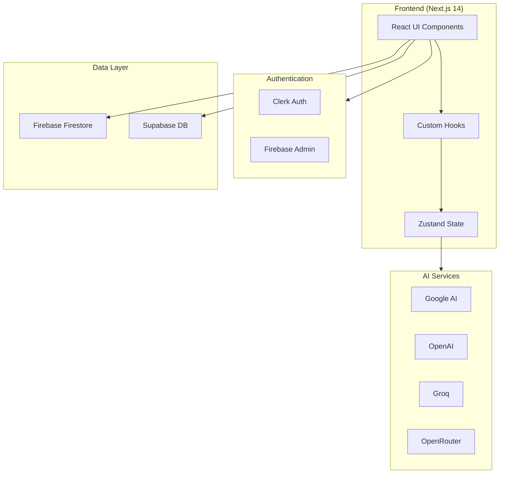
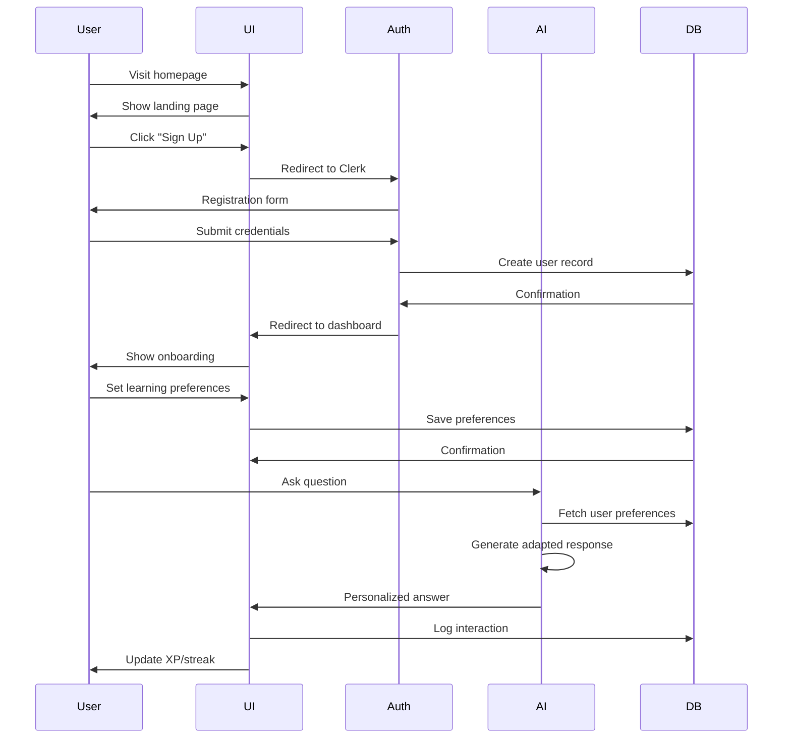
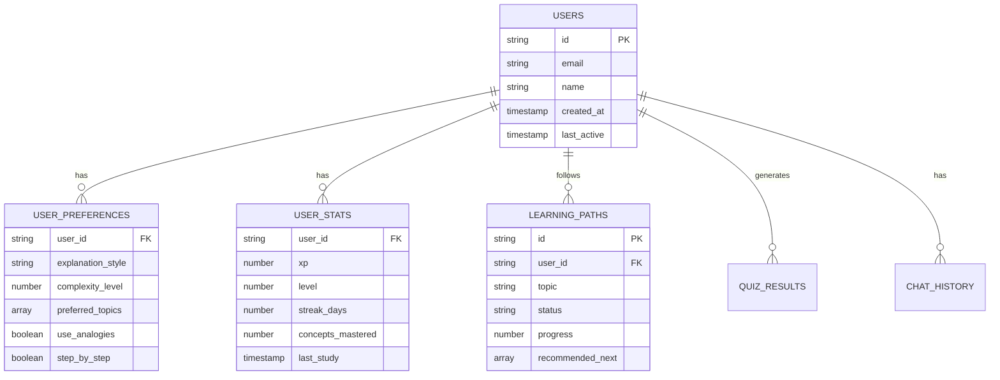
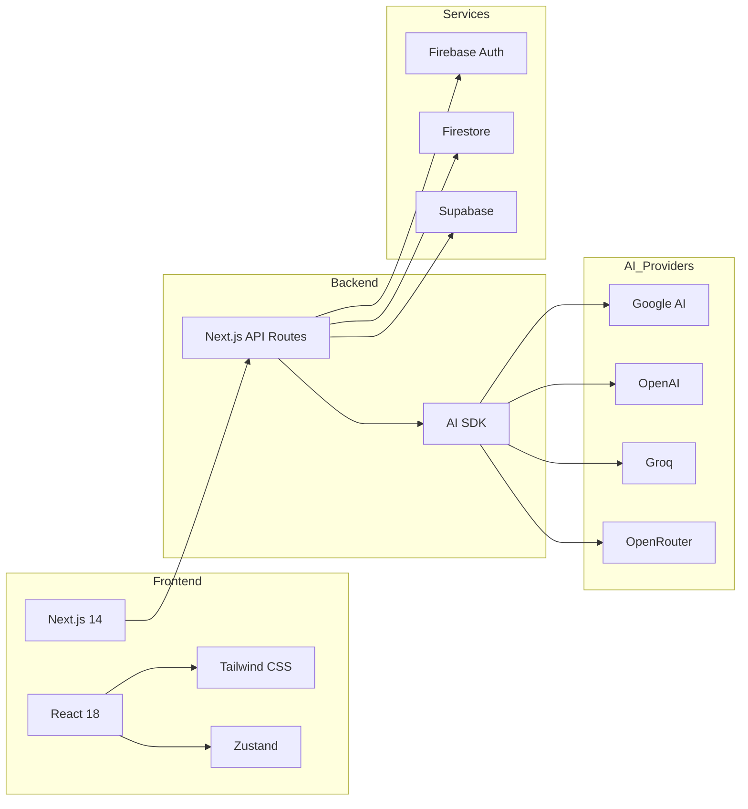
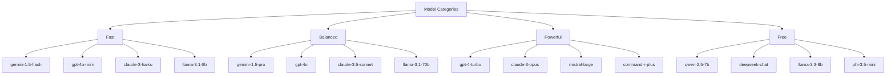
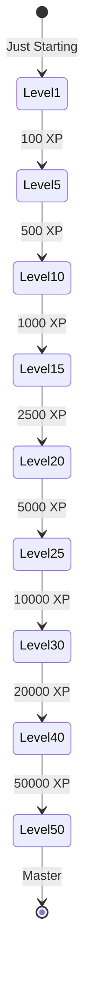
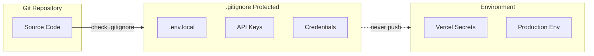

# LearnAI - Intelligent Learning Assistant

An AI-powered personalized learning platform that adapts to how each student learns. Built with Next.js, Firebase, Supabase, and multiple AI model providers.


## Overview

**LearnAI** is an intelligent tutoring system designed to provide personalized learning experiences. Unlike traditional one-size-fits-all education platforms, LearnAI:

- Adapts explanations to each learner's preferences
- Uses spaced repetition for optimized memory retention
- Provides interactive quizzes that scale difficulty based on performance
- Tracks progress with gamification elements (XP, streaks, levels)
- Supports multiple AI model providers for flexibility

## Features

| Feature | Description |
|---------|-------------|
| **Adaptive Tutoring** | AI chat that adjusts explanation depth/style based on user preferences |
| **Smart Quizzes** | Questions that get easier/harder based on performance |
| **Learning Paths** | Personalized curriculum based on knowledge gaps |
| **Spaced Repetition** | Scientific review scheduling to maximize retention |
| **Progress Tracking** | Visual analytics showing mastery over time |
| **Gamification** | XP, streaks, levels, and achievements to maintain motivation |

## Architecture

### System Overview



### User Flow



### Data Model



### Technical Stack



## Project Structure

```
intelligent-learning-assistant/
├── app/                          # Next.js App Router
│   ├── api/                      # API Routes
│   │   ├── learning/             # Learning & assessment
│   │   ├── progress/            # Progress tracking
│   │   ├── stats/             # User statistics
│   │   ├── tutor/             # AI tutor chat
│   │   └── ocr/               # OCR processing
│   ├── dashboard/              # Protected dashboard
│   │   ├── chat/              # AI tutor
│   │   ├── learning-path/     # Learning paths
│   │   ├── progress/          # Progress analytics
│   │   ├── quiz/             # Practice quizzes
│   │   └── settings/          # User settings
│   ├── sign-in/               # Authentication
│   ├── sign-up/
│   ├── onboarding/
│   ├── layout.tsx             # Root layout
│   ├── page.tsx               # Landing page
│   └── globals.css            # Global styles
│
├── components/                 # React Components
│   ├── chat/                # Chat UI
│   │   ├── chat-window.tsx
│   │   └── message-bubble.tsx
│   ├── gamification/          # Gamification
│   │   ├── spaced-repetition.tsx
│   │   └── xp-display.tsx
│   ├── layout/               # Layout components
│   │   ├── header.tsx
│   │   └── sidebar.tsx
│   └── quiz/                # Quiz components
│       ├── progress-ring.tsx
│       └── quiz-card.tsx
│
├── hooks/                   # Custom React Hooks
│   ├── use-api-keys.ts
│   ├── use-chat.ts
│   ├── use-progress.ts
│   └── use-stats.ts
│
├── lib/                     # Utilities & Configs
│   ├── ai.ts               # AI SDK wrapper
│   ├── api-keys.ts         # API key management
│   ├── auth.ts            # Auth utilities
│   ├── auth-client.ts      # Client auth
│   ├── firebase.ts         # Firebase client
│   ├── firebase-admin.ts   # Firebase admin
│   ├── supabase.ts        # Supabase client
│   ├── types.ts           # TypeScript types
│   └── utils.ts           # Utility functions
│
├── stores/                 # State Management
│   └── chat-store.ts      # Zustand chat store
│
├── .env.example           # Environment template
├── .gitignore            # Git ignore rules
├── next.config.js        # Next.js config
├── package.json         # Dependencies
├── postcss.config.js    # PostCSS config
├── tailwind.config.js  # Tailwind config
└── tsconfig.json      # TypeScript config
```

## Getting Started

### Prerequisites

- Node.js 18+
- npm or yarn
- Firebase project
- Supabase project
- AI provider API keys (optional)

### Installation

```bash
# Clone the repository
git clone <your-repo-url>
cd intelligent-learning-assistant

# Install dependencies
npm install

# Copy environment template
cp .env.example .env.local
```

### Environment Variables

```env
# ============================================
# CLERK AUTHENTICATION
# ============================================
NEXT_PUBLIC_CLERK_PUBLISHABLE_KEY=pk_test_...
CLERK_SECRET_KEY=sk_test_...
NEXT_PUBLIC_CLERK_SIGN_IN_URL=/sign-in
NEXT_PUBLIC_CLERK_SIGN_UP_URL=/sign-up
NEXT_PUBLIC_CLERK_AFTER_SIGN_IN_URL=/dashboard
NEXT_PUBLIC_CLERK_AFTER_SIGN_UP_URL=/dashboard

# ============================================
# SUPABASE DATABASE
# ============================================
NEXT_PUBLIC_SUPABASE_URL=https://xxx.supabase.co
NEXT_PUBLIC_SUPABASE_ANON_KEY=xxx
SUPABASE_SERVICE_ROLE_KEY=xxx

# ============================================
# GOOGLE GENERATIVE AI
# ============================================
GOOGLE_API_KEY=AIzaSy...

# ============================================
# OPTIONAL PROVIDERS
# ============================================
# OPENAI_API_KEY=sk-...
# GROQ_API_KEY=gsk_...
# OPENROUTER_API_KEY=sk-or-...
# TAVILY_API_KEY=tv-...
```

### Development

```bash
# Start development server
npm run dev

# Build for production
npm run build

# Start production server
npm run start

# Run linter
npm run lint
```

## API Reference

### Core Endpoints

| Endpoint | Method | Description |
|----------|--------|-------------|
| `/api/tutor/ask` | POST | AI tutor chat |
| `/api/learning/assess` | POST | Knowledge assessment |
| `/api/learning/path` | GET | Get learning path |
| `/api/learning/preferences` | POST | Save preferences |
| `/api/progress` | GET | Get progress stats |
| `/api/stats` | GET | Get user stats |
| `/api/ocr` | POST | Process image OCR |

### AI Models Supported



## Gamification System

### XP & Levels



### Level Titles

| Level | Title |
|-------|-------|
| 1 | Just Starting |
| 5 | Getting the Hang of It |
| 10 | Building Momentum |
| 15 | Finding Your Rhythm |
| 20 | Consistent Learner |
| 25 | Knowledge Builder |
| 30 | Quick Study |
| 35 | Dedicated Learner |
| 40 | Learning Machine |
| 45 | Scholar |
| 50 | Master |

## Security

### Secrets Management



- **NEVER** commit `.env.local` or real API keys
- All secrets go in `.env.local` (gitignored)
- Use `.env.example` as template for collaborators
- Configure secrets in deployment platform (Vercel)

## Deployment

### Vercel (Recommended)

```bash
# Install Vercel CLI
npm i -g vercel

# Deploy
vercel --prod
```

Or connect your GitHub repo to Vercel for automatic deployments.

## Contributing

1. Fork the repository
2. Create a feature branch
3. Make your changes
4. Run `npm run lint` to check code quality
5. Submit a pull request

## License

MIT License - see LICENSE file for details.

## Acknowledgments

- [Next.js](https://nextjs.org/) - React framework
- [Firebase](https://firebase.google.com/) - Authentication & database
- [Supabase](https://supabase.com/) - Database
- [Vercel](https://vercel.com/) - Deployment
- [AI SDK](https://sdk.vercel.ai/) - AI integration